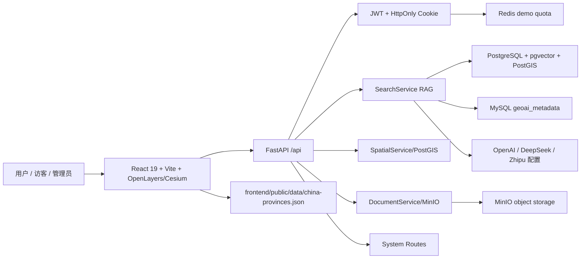
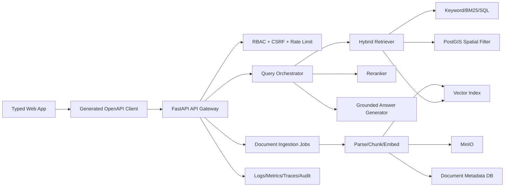

# GeoRAG Planning Assistant 架构审计与改造 PRD

审计日期：2026-06-16  
审计角色：架构师 / 产品技术负责人视角  
审计范围：`Backend`、`frontend`、`docker-compose.yml`、`docker/`、`docs/`、`scripts/`、根目录 Python 工程、测试与发布流程。  
审计方式：静态代码审查、配置审查、现有测试/构建命令验证、官方行业标准对标。未连接生产数据库、真实对象存储、真实 LLM 服务和线上流量，因此性能与数据质量结论以代码和配置证据为准。

## 1. 结论摘要

当前项目已经具备一个清晰的产品雏形：面向国土空间规划、测绘、标准政策资料的 RAG 检索 + 大模型问答 + 2D/3D 地图联动。前端体验投入较多，FastAPI 后端也已经把认证、搜索、空间、文档、系统管理拆出 API 模块；部署文档里也出现了生产安全意识，例如 HTTPS、强随机密钥、不暴露数据库端口、版本可追溯发布。

但从“行业最高标准”的生产级要求看，当前状态更接近可演示系统，而不是可长期运行、可审计、可扩展、可安全开放的企业级平台。核心差距集中在七个方面：

1. 产品契约不闭环：前端调用了后端不存在的接口，后端部分接口返回占位结果，OpenAPI/TypeScript/Pydantic 没有单一事实源。
2. RAG 主链路过度集中：`SearchService` 同时承担检索、SQL、意图识别、提示词、生成、地图动作解析、日志等职责，空间过滤、元数据过滤、重排序、相似文档、日志仍是 TODO。
3. 文档管理未形成上传到检索的闭环：上传到 MinIO 后没有可靠元数据持久化、解析、切分、embedding、索引、状态机、重试与可观测任务队列。
4. 空间能力大量为模拟实现：地理编码、逆地理编码、空间查询、buffer、intersection 等接口存在，但返回硬编码或空结果，前端地图又主要使用静态 `china-provinces.json`。
5. 安全和运维达到“有意识”但未达到“体系化”：Cookie、管理员认证、系统 API Key、日志、配置、CORS、速率限制、CSRF、密钥管理、系统管理接口都需要按 OWASP/NIST 做完整基线。
6. 前端工程缺少生产级类型和状态治理：`App.tsx` 约 60KB，承担过多职责；`tsconfig` 未启用 `strict`；多个服务层接口与后端不一致；聊天历史允许客户端传入 `system` role。
7. 交付链条不完整：有局部测试和 lint，但缺 CI、契约测试、集成测试、E2E、依赖审计、镜像扫描、SBOM、构建来源证明、迁移治理和回滚演练。

本 PRD 的核心建议：先用 1 个“契约与安全硬化 PR”止血，再用 2-3 个迭代把 RAG、文档、空间和前端状态拆成可验证的子系统，最后建设 CI/CD、观测性、评测集和数据治理。

## 2. 对标标准

本次按以下官方标准和实践做基线对标：

- OWASP ASVS：应用安全验证要求，覆盖认证、会话、访问控制、输入验证、配置、API 等。  
  https://owasp.org/www-project-application-security-verification-standard/
- OWASP API Security Top 10 2023：API 授权、认证、资源消耗、对象属性授权、安全配置、SSRF 等风险。  
  https://owasp.org/API-Security/editions/2023/en/0x00-header/
- NIST SSDF SP 800-218：安全软件开发框架，要求把安全活动嵌入设计、实现、验证、发布和响应。  
  https://csrc.nist.gov/pubs/sp/800/218/final
- SLSA v1.2：软件供应链完整性，关注构建来源、可追溯性、防篡改和依赖链风险。  
  https://slsa.dev/spec/v1.2/about
- 12-Factor App：配置外置、日志事件流、进程无状态、开发/生产一致性、快速启动和优雅关闭。  
  https://12factor.net/
- OpenAPI Specification：API 的机器可读契约，用于文档、SDK、测试、mock 和变更治理。  
  https://spec.openapis.org/oas/latest.html
- Web Vitals：前端用户体验核心指标，包括 LCP、INP、CLS。  
  https://web.dev/articles/vitals

## 3. 当前系统地图

目标形态应改为：

## 4. 验证结果

已执行：

- `npm.cmd run lint`：通过。实际包含编码检查和 `tsc --noEmit`。
- `Backend\.venv\Scripts\python -m pytest Backend\tests -q`：26 个测试通过。
- `Backend\.venv\Scripts\python -c "import os; os.chdir('Backend'); import main; print('backend_import_ok')"`：通过。

受阻：

- `npm.cmd run build`：在 `prebuild` 阶段执行 `sync-cesium-assets.mjs` 时，复制 `frontend/public/cesium/Assets/approximateTerrainHeights.json` 被本地文件权限拒绝。提权重试审批两次超时，因此无法确认正式构建是否通过。

验证结论：

- 现有质量闸门能证明部分代码可类型检查、部分后端单元逻辑可运行。
- 当前测试未充分覆盖真实数据库、真实 MinIO、真实 embedding、真实空间查询、前后端接口契约、SSE 流、文档上传索引闭环、系统管理接口和部署安全。
- `npm run build` 的前置资源同步对本地文件权限敏感，需要改成幂等、可跳过、可诊断的构建步骤。

## 5. 分级问题清单

### P0 必须优先处理

| 编号 | 问题 | 证据 | 影响 | 改动方向 |
|---|---|---|---|---|
| P0-01 | 前后端接口契约不一致 | `frontend/src/services/searchService.ts` 调用 `/search/feedback`，后端无该路由；`documentService.ts` 调用 `PATCH /documents/{id}`、`/documents/batch`，后端无对应接口 | 用户操作失败，测试无法发现，产品能力虚假可用 | 以 OpenAPI 为单一契约，生成 TS client，增加契约测试 |
| P0-02 | 文档管理主流程未闭环 | `DocumentService.get_document/list_documents/update/delete/reindex/statistics/search_documents` 多处返回 `None`、`[]`、`True` 或零值 | 上传后不可检索、不可管理，文档系统只是对象存储演示 | 建立文档表、索引任务表、状态机、解析/切分/embedding/job worker |
| P0-03 | RAG 过滤和重排序大量 TODO | `SearchService._apply_spatial_filter`、`_matches_metadata_filter`、`_spatial_search`、`_rerank_results`、`_log_search` 未实现 | 搜索结果无法按空间/元数据精准约束，回答可信度不可控 | 拆检索层，先实现 SQL/PostGIS 过滤，再加 rerank 和评测 |
| P0-04 | 客户端可传入 `system` role | `frontend/src/App.tsx` 组装 history 时包含 `{ role: 'system' }`，后端 `SearchRequest.history` 接受 `List[Dict[str,str]]` | 客户端可影响系统提示词边界，存在提示词注入/越权控制风险 | 后端只接受 `user/assistant` 历史，丢弃或拒绝 `system/tool/developer` role |
| P0-05 | 系统管理接口风险过高 | `/api/system/config`、`/logs`、`/clear-cache`、`/metrics`、`/restart`；`require_clear_cache_confirmation` 错误信息暴露期望确认值 | 配置和日志泄露、缓存误清、阻塞式 metrics、管理面攻击面过大 | 管理面独立网络/RBAC/审计；敏感字段白名单；日志分页脱敏；危险操作二次授权 |
| P0-06 | docker 默认暴露基础设施端口 | `docker-compose.yml` 映射 `5432/3306/6379/9000/9001`，并使用 `change_me_*` 默认值 | 演示环境容易误暴露数据库和对象存储 | 用 dev/prod compose profile；生产默认不映射基础设施端口；启动时拒绝弱默认密码 |
| P0-07 | embedding/provider 配置可能直接导致搜索不可用 | `LLM_PROVIDER=deepseek` 时 embedding provider 仍走 OpenAI；`ZHIPU` embedding 未实现；`SearchService.search()` 优先获取 query embedding | 没有 OpenAI embedding key 时，keyword/exact search 也可能失败 | embedding 与 chat provider 解耦；检索降级路径；启动自检明确 provider 状态 |

### P1 高优先级

| 编号 | 问题 | 证据 | 影响 | 改动方向 |
|---|---|---|---|---|
| P1-01 | `SearchService` 是巨型服务 | 文件约 61KB；同时包含 SQL、业务规则、提示词、流解析、意图识别、日志 | 难测试、难替换、难演进 Agent/tool calling | 拆为 `QueryPlanner`、`Retriever`、`Reranker`、`AnswerGenerator`、`CitationBuilder` |
| P1-02 | `detect_intent` 重复定义 | `search_service.py` 中出现两次 `async def detect_intent`，后者覆盖前者 | 前一版逻辑失效且不易被发现 | 删除死代码，补意图识别单元测试 |
| P1-03 | 空间 API 多为模拟数据 | `spatial_routes.py` 与 `spatial_service.py` 多处 TODO，返回北京示例/空结果/简单方框 | 地理功能无法用于真实规划分析 | 用 PostGIS 实现 `intersects/within/near/buffer/intersection` |
| P1-04 | 前端地图数据源与后端空间 API 分裂 | `bootstrap.ts` 加载 `/data/china-provinces.json`，不是 `/api/spatial/provinces` | 数据更新、权限、缓存和后端空间能力脱节 | 统一空间数据源；静态文件只作 fallback |
| P1-05 | 配额消费存在并发竞争 | `DemoQuotaService.consume_generation` 先读状态再分别 `incr/expire` 三个 key | 高并发下可能超额，且三类计数可能部分成功 | Redis Lua 脚本或事务一次性检查和递增 |
| P1-06 | 数据库初始化失败后重试状态不可靠 | `DatabaseManager.initialize()` 先设置 `_initialized=True`，后续失败 close 后可能跳过重试 | 启动/恢复场景不稳定 | 初始化成功后再置 true；失败时重置状态 |
| P1-07 | 文档元数据查询全表扫描 | `get_metadata_rows_by_standard_codes()` 调 `list_metadata_rows()` 后在 Python 过滤 | 数据量大时延迟和内存不可控 | SQL `WHERE standard_code IN (...)`，加索引和分页 |
| P1-08 | 运行时 schema migration | `document_asset_service.ensure_asset_columns()` 在服务内 `ALTER TABLE` | 生产不可控、权限过大、难回滚 | 引入 Alembic 或等价迁移体系 |
| P1-09 | 前端核心组件过大 | `App.tsx` 约 60KB，`CesiumGlobe.tsx` 28KB，`LoginPage.tsx` 23KB | 状态耦合、回归风险高、测试困难 | 按 feature/domain 拆 hook、container、presentational component |
| P1-10 | TypeScript 严格模式未启用 | `tsconfig.json` 无 `strict`，且 `allowJs: true` | `any` 和空值错误难提前发现 | 分阶段开启 `strict`、`noUncheckedIndexedAccess`、移除不必要 `allowJs` |
| P1-11 | 正式构建前置脚本不够稳 | `npm run build` 因 Cesium 资源复制权限失败 | CI/服务器构建可能偶发失败 | 资源同步幂等化、哈希比较、只写 dist 或清晰提示 |
| P1-12 | 文档编码异常 | 多个 `.md`、模型注释输出为乱码 | 知识传递和交付协作受损 | 全仓 UTF-8 检查和一次性修复，CI 强制 |

### P2 中优先级

| 编号 | 问题 | 影响 | 改动方向 |
|---|---|---|---|
| P2-01 | 前端依赖含 `@google/genai`、`express`、`dotenv` 等疑似非浏览器运行时依赖 | 包体积、安全面和依赖审计成本上升 | 确认用途，移到 devDependencies 或删除 |
| P2-02 | 根目录 `requirements.txt` 与 `Backend/requirements.txt` 分裂 | 依赖版本冲突，环境复现困难 | 明确一个后端运行依赖源，根目录只保留工具或归档 |
| P2-03 | Pydantic V1 风格 validator 警告 | 后续升级到 Pydantic V3 风险 | 迁移到 `field_validator`/`ConfigDict` |
| P2-04 | 搜索 SQL 对标准号做函数处理 | 可能无法使用普通索引 | 增加规范化列或表达式索引 |
| P2-05 | LLM prompt 输出 JSON code block 让前端解析地图动作 | 模型输出脆弱，流式解析困难 | 改为结构化 tool/action schema |
| P2-06 | 系统日志使用原始文件读取 | 文件大时内存和响应不可控 | 分页、游标、按 request_id 查询、脱敏 |
| P2-07 | `clean` 脚本使用 `rm -rf` | Windows 环境不可移植 | 改用 Node 脚本或 `rimraf` |

## 6. 功能域审视

### 6.1 认证、授权、会话

当前能力：

- 管理员登录、访客体验、登出、`/auth/me` 已实现。
- 使用 JWT + HttpOnly Cookie。
- 生产建议文档已强调 HTTPS 与 `AUTH_COOKIE_SECURE=True`。

不足：

- 单管理员模型无法支撑真实组织、审计、权限分离。
- `ADMIN_PASSWORD` 明文 fallback 可以短期开发使用，但生产必须禁止。
- 没有登录失败限速、账号锁定、密码策略、审计日志。
- 没有 CSRF token。Cookie 会自动携带，涉及 POST/DELETE/PATCH 的接口需要 CSRF 或 SameSite + Origin 验证组合。
- `get_client_ip` 直接信任 `x-forwarded-for`，缺少可信代理配置。
- 访客 JWT 过期和 Cookie `max_age` 存在不一致风险：访客 token 1 天，`set_auth_cookie` 默认按 `ACCESS_TOKEN_EXPIRE_MINUTES`。

目标要求：

- 建立用户、角色、权限表：`admin`、`operator`、`viewer`、`demo_visitor`。
- 所有管理类 API 明确 require scope，例如 `system:read`、`system:write`、`document:write`。
- 生产环境禁止 `ADMIN_PASSWORD`，只允许 `ADMIN_PASSWORD_HASH` 或外部身份源。
- 增加登录速率限制、失败审计、账号锁定/冷却。
- 对所有状态变更接口增加 CSRF 或 Origin 校验。
- 可信代理列表外的 `X-Forwarded-For` 不参与限流和审计身份。

验收标准：

- 未授权访问受保护 API 返回统一 `401/403`，不泄露内部配置。
- 访客不能访问系统管理、文档删除、缓存清理、日志读取。
- 认证和授权有单元测试、集成测试、E2E 测试。

### 6.2 API 契约与错误模型

当前能力：

- FastAPI Pydantic 模型已覆盖搜索、空间、文档部分对象。
- 前端有 `types/api.ts` 和 `types/index.ts`。

不足：

- 前端类型不是从 OpenAPI 生成，已经出现接口漂移。
- 后端多个异常把 `str(exc)` 暴露给用户，例如搜索和空间接口。
- `POST /search/query` 声明 `response_model=SearchResponse`，但 `stream=true` 返回 `StreamingResponse`，文档契约表达不清。
- 部分接口返回占位成功，导致调用方无法区分“未实现”和“成功但无数据”。

目标要求：

- OpenAPI 成为单一事实源。
- 前端使用生成 client，不手写 URL 字符串和重复 DTO。
- 统一错误响应：
  - `code`
  - `message`
  - `request_id`
  - `details`（仅安全白名单）
  - `retryable`
- 未实现接口返回 `501 Not Implemented` 或隐藏，不返回假成功。
- SSE 接口独立为 `/search/query/stream` 或在 OpenAPI 中明确 `text/event-stream`。

验收标准：

- CI 中新增契约测试：前端服务层调用的 endpoint 必须存在于 OpenAPI。
- 任意 500 响应不包含数据库连接串、堆栈、provider 错误细节、文件路径。

### 6.3 RAG 检索与回答生成

当前能力：

- 支持 exact standard code、keyword、vector、hybrid 基本路径。
- 支持生成回答、引用文档、部分 follow-up 上下文。
- 有 demo quota 对访客生成成本做限制。

不足：

- 搜索前置依赖 embedding，embedding 不可用时连 keyword/exact search 也可能失败。
- 空间过滤、元数据过滤、重排序、相似文档、搜索日志均未完成。
- prompt 让模型输出 Markdown JSON code block 给前端解析地图动作，缺少稳定 schema。
- 历史消息按数量截断，不按 token 预算，不校验 role。
- `stream_answer` 内部累积完整答案后再解析动作，长回答会增加内存占用，且前端未真正使用 SSE。
- 缺少 RAG 评测集、召回率/准确率/引用命中率/幻觉率指标。

目标要求：

- 搜索编排拆层：
  - `QueryNormalizer`
  - `IntentClassifier`
  - `Retriever`
  - `FilterCompiler`
  - `Reranker`
  - `CitationBuilder`
  - `AnswerGenerator`
  - `ActionExtractor`
- provider 解耦：
  - chat provider
  - embedding provider
  - rerank provider
- 对 exact/keyword search 提供无 embedding 降级路径。
- 结构化输出使用后端 schema 校验，前端只消费 `map_action` 字段，不解析自由文本。
- RAG 结果必须可解释：每段引用含 `document_id`、`chunk_id`、`standard_code`、`page/section`、`score`。
- 建立评测集：
  - 标准号精确检索
  - 中文政策问答
  - 空间约束问答
  - follow-up 指代消解
  - 无答案/拒答场景

验收标准：

- embedding provider 关闭时，标准号精确检索和关键词检索仍可用。
- 空间 filter 真实影响结果。
- 每个回答的引用能追溯到 chunk。
- RAG 评测在 CI 或 nightly job 产生报告。

### 6.4 文档管理与索引

当前能力：

- 有上传、预签名 URL、下载、批量上传、统计、详情、删除、重建索引等 API 轮廓。
- 有 MinIO 对象存储集成。
- 有 `DocumentAssetService` 对 MySQL 元数据和本地文件路径做映射。

不足：

- 上传只落对象存储，不落稳定文档记录和索引任务。
- `list/statistics/delete/reindex/search` 是占位实现。
- 上传整文件读入内存，最大 100MB，缺少分片/流式/病毒扫描/内容类型真实检测。
- `DocumentService` 作为依赖按请求创建，构造时检查 bucket 和设置 policy，开销和副作用过重。
- 使用 MD5 做内容哈希，应改 SHA-256。
- 缺少文档生命周期：uploaded -> parsing -> chunking -> embedding -> indexed -> failed。
- 缺少幂等上传、重复文件识别、失败重试、人工修复入口。

目标要求：

数据模型至少包含：

- `documents`
  - `id`
  - `filename`
  - `sha256`
  - `mime_type`
  - `size`
  - `storage_bucket`
  - `storage_key`
  - `status`
  - `created_by`
  - `created_at`
  - `updated_at`
- `document_versions`
- `document_chunks`
- `document_embeddings`
- `index_jobs`
- `document_events`

流程要求：

1. 上传文件，服务端校验大小、类型、hash。
2. 写入 `documents` 和 `index_jobs`。
3. worker 异步解析、切分、embedding、写 pgvector。
4. UI 展示状态和错误原因。
5. 删除时同时处理对象、索引、元数据和审计记录。

验收标准：

- 上传一个 PDF 后，能在 UI 看到 processing 状态，最终可检索并可下载原文。
- reindex 可重试失败任务。
- 删除后搜索结果不再出现该文档。
- 批量上传对每个文件返回独立成功/失败。

### 6.5 空间数据与地图联动

当前能力：

- 前端有 OpenLayers 和 Cesium 两套地图体验。
- 后端有 `/spatial/provinces` 读取 PostGIS 的实现。
- 前端能解析部分地图动作并高亮行政区。

不足：

- 大量空间接口是 TODO 或模拟数据。
- 前端启动依赖静态 `china-provinces.json`，没有复用后端 `/api/spatial/provinces`。
- 行政区 code/name 映射在前端多处重复。
- 缺少空间数据版本、简化等级、缓存策略、瓦片服务策略。
- Cesium 的 `contextmenu` 事件监听使用匿名函数添加，清理不可控。

目标要求：

- 后端作为空间数据权威源，静态文件只作为离线 fallback。
- `SpatialService` 使用 PostGIS 实现：
  - `ST_Intersects`
  - `ST_Within`
  - `ST_Contains`
  - `ST_DWithin`
  - `ST_Buffer`
  - `ST_Intersection`
- 行政区数据建立版本表和缓存键。
- 地图动作由后端结构化返回：
  - `action`
  - `adcode`
  - `region_name`
  - `viewport`
  - `confidence`
- 前端 map store 统一 2D/3D viewport 状态。

验收标准：

- 空间过滤搜索能返回不同于普通搜索的结果集合。
- 点击/LLM 定位同一行政区时，OpenLayers 和 Cesium 表现一致。
- 空间 API 有真实 PostGIS 集成测试。

### 6.6 前端架构与体验

当前能力：

- UI 完整度高，有登录页、启动页、聊天、搜索结果、地图联动、文档详情。
- `AuthProvider` 做了会话恢复和未授权事件处理。
- `ReactMarkdown` 未发现 `rehypeRaw` 或 `dangerouslySetInnerHTML` 直接渲染，Markdown 安全面相对可控。

不足：

- `App.tsx` 承担过多业务，包含启动、主题、搜索、聊天、地图动作、文档详情、下载、follow-up 解析。
- 前端服务层有 TODO 和不存在的后端接口。
- `tsconfig` 没有严格模式。
- `ChatMessage` 类型允许 `system` role，并实际向后端传入。
- 错误处理有时吞掉异常返回空数组或友好消息，影响故障发现。
- 未引入统一 server state 管理，缺少缓存、重试、取消、并发一致性策略。
- 没有明确 Web Vitals、bundle budget、地图资源加载预算。

目标要求：

- 拆分前端模块：
  - `features/auth`
  - `features/search`
  - `features/chat`
  - `features/map`
  - `features/documents`
  - `shared/api`
  - `shared/ui`
- 引入生成式 API client 和 typed error。
- 使用 React Query 或等价 server-state 层管理请求、缓存、取消和错误。
- `App.tsx` 只保留路由和顶层布局。
- 聊天 UI 使用真实 SSE，停止生成中断流。
- 对地图组件建立视觉/交互回归测试。

验收标准：

- `strict` 分阶段开启并保持 CI 通过。
- 所有服务层 endpoint 从 OpenAPI client 生成。
- `App.tsx` 缩到顶层 composition，不承载领域规则。
- P95 首屏、地图 ready、聊天首 token 时间有指标。

### 6.7 数据库与数据治理

当前能力：

- PostgreSQL + pgvector + PostGIS、MySQL、Redis 都已接入。
- 健康检查能检查核心数据库连接。

不足：

- 没有正式迁移工具。
- 应用启动时创建扩展和可能修改 schema，生产权限边界偏大。
- MySQL 和 PostgreSQL 数据职责边界不清：标准元数据、切片、文档资产分散。
- 没有备份、恢复、数据版本、索引重建策略。
- SQL 性能策略不足：全表读取元数据、`ILIKE '%term%'`、函数包裹索引列、向量阈值在 Python 过滤。

目标要求：

- 引入迁移体系。
- 明确数据 ownership：
  - PostgreSQL：检索切片、向量、空间数据、搜索日志、文档状态。
  - MySQL：如必须保留，则只作为外部元数据源或迁移到 PostgreSQL。
  - Redis：配额、短期缓存、分布式锁。
  - MinIO：原始文件和衍生文件。
- 建立索引策略和查询计划基线。
- 所有数据导入任务有版本、来源、校验和、可重放记录。

验收标准：

- 新环境可通过迁移命令一键创建 schema。
- 任意文档、chunk、embedding、搜索日志都可追溯来源。
- 关键查询有 explain 记录和性能阈值。

### 6.8 安全、隐私与系统管理

不足：

- CORS `allow_methods=["*"]`、`allow_headers=["*"]` 较宽，需要生产收敛。
- `/system/info` 暴露 hostname/platform/memory。
- `/system/logs` 可读原始日志，缺少脱敏和分页。
- `LLMConfig` debug 日志记录 embedding 输入前 100 字符，可能泄露用户查询或文档内容。
- `vite.config.ts` 将 `process.env.GEMINI_API_KEY` 注入客户端 bundle，任何真实密钥都会泄露。
- `.env` 文件虽然被 gitignore，但本地存在，仍需 secrets hygiene 和轮换流程。

目标要求：

- 前端绝不嵌入任何服务端 API Key。
- 敏感配置只通过环境变量/secret manager 注入。
- 日志默认脱敏 query、token、cookie、API key、连接串、用户输入原文。
- 管理面增加 IP allowlist、RBAC、审计、危险操作确认。
- 加入依赖漏洞扫描、secret scanning、镜像扫描。

验收标准：

- 构建产物中扫描不到 API key 字段值。
- 任意错误响应和系统接口不泄露密钥、连接串、堆栈。
- 安全扫描进入 CI。

### 6.9 DevOps、供应链与发布

当前能力：

- 有 Dockerfile、docker-compose、部署文档、发布流程文档。
- Dockerfile 后端阶段使用非 root 用户。
- 前端构建有 commit meta 思路。

不足：

- Compose 默认值和生产文档不完全一致。
- 无 CI workflow。
- 无 SBOM、镜像扫描、依赖审计、签名和来源证明。
- `Backend/requirements.txt` 版本较旧，根依赖和后端依赖不统一。
- `docker/Dockerfile` 前后端在同一文件中，未明确多环境 profile。

目标要求：

- CI stages：
  1. format/lint/typecheck
  2. unit tests
  3. contract tests
  4. integration tests with services
  5. frontend build
  6. dependency audit
  7. docker build and scan
  8. SBOM/provenance artifact
- Compose 拆分：
  - `docker-compose.dev.yml`
  - `docker-compose.prod.yml`
  - `docker-compose.observability.yml`
- 生产禁用默认弱密码。
- 发布包必须绑定 commit、image digest、migration version。

验收标准：

- PR 未通过 CI 不可合并。
- 发布后能从页面 `build-meta.json`、后端 `/health`、镜像 digest 对应到同一 commit。

### 6.10 测试与质量体系

当前能力：

- 后端有 26 个测试通过。
- 前端 lint/typecheck 通过。
- 有若干前端测试文件，但 `package.json` 未提供 test script。

不足：

- 没有统一测试矩阵和覆盖率阈值。
- 缺少真实 API contract、E2E、数据库集成、MinIO 集成、RAG 评测。
- 测试目录里存在独立 Cesium 测试项目和本地 `node_modules`，虽未被 git 跟踪，但会干扰审计和工具扫描。
- Pytest 写 `.pytest_cache` 出现权限警告，需要清理本地权限或禁用缓存。

目标要求：

- 后端测试：
  - auth/security
  - quota concurrency
  - search fallback
  - PostGIS filters
  - document indexing lifecycle
  - system API authorization
- 前端测试：
  - service contract tests
  - hooks tests
  - component tests
  - Playwright E2E
  - map rendering smoke tests
- AI/RAG 评测：
  - golden query set
  - citation correctness
  - no-answer behavior
  - regression dashboard

验收标准：

- CI 可一键跑核心测试。
- 关键业务 PR 必须带测试或明确风险豁免。

## 7. 接口逐项审视

本节按现有后端路由逐项评估。状态说明：

- 可用：已有真实业务实现，但仍可能需要安全、观测性或测试增强。
- 半可用：主路径存在，但边界、契约或持久化不完整。
- 占位：接口存在，但返回模拟、空结果、假成功或 TODO。
- 高风险：接口本身涉及敏感操作、信息泄露或破坏性操作。

### 7.1 根入口

| 接口 | 当前状态 | 主要问题 | 改造要求 |
|---|---|---|---|
| `GET /health` | 可用 | 依赖 Postgres/MySQL，Redis 可选；状态模型较简单 | 拆为 `livez` 和 `readyz`；返回 request_id、build version、dependency state；不要暴露过多内部细节 |

### 7.2 `/api/auth`

| 接口 | 当前状态 | 主要问题 | 改造要求 |
|---|---|---|---|
| `POST /api/auth/login` | 半可用 | 单管理员；无失败限速/锁定/审计；生产仍可用明文密码 fallback | 增加 rate limit、失败审计、密码 hash 强制、统一错误响应 |
| `POST /api/auth/demo` | 可用 | 访客身份与配额依赖 Redis；IP 来源信任 `X-Forwarded-For` | 可信代理配置、访客会话过期与 cookie 过期一致、访客能力 scope 化 |
| `POST /api/auth/logout` | 可用 | 仅清 Cookie，无服务端会话撤销 | 如继续 stateless JWT，接受；如管理安全升级，应引入 token version/session blacklist |
| `GET /api/auth/me` | 可用 | 返回身份基础信息，缺少 permissions/scopes | 返回明确 role/scope/quota；前端按 scope 控制功能 |

### 7.3 `/api/search`

| 接口 | 当前状态 | 主要问题 | 改造要求 |
|---|---|---|---|
| `GET /api/search/health` | 可用 | 健康信息与真实 provider/index 状态关联不足 | 纳入 embedding provider、LLM provider、vector index、metadata DB 状态 |
| `POST /api/search/query` | 半可用 | `stream=true` 与 `response_model` 契约冲突；embedding 失败可能阻断 keyword/exact；异常 detail 泄露内部错误 | 分离普通查询和流式查询；检索降级；统一错误模型；history role 校验 |
| `POST /api/search/hybrid` | 半可用 | 只是调用 search 主流程；异常 detail 泄露；hybrid 语义未形成稳定策略 | 明确 hybrid 权重、召回数量、融合算法、rerank 策略 |
| `GET /api/search/suggest` | 占位 | 当前返回空建议 | 接入热门 query、标准号前缀、同义词、拼写纠错；或暂时移除 |
| `GET /api/search/similar/{doc_id}` | 占位/半可用 | `_get_document_embedding` TODO，通常返回空 | 实现 chunk/document embedding 查询；定义相似度阈值和权限 |
| `POST /api/search/feedback` | 缺失 | 前端已调用，后端无路由 | 补充反馈表和接口，或删除前端入口 |

### 7.4 `/api/spatial`

| 接口 | 当前状态 | 主要问题 | 改造要求 |
|---|---|---|---|
| `POST /api/spatial/query` | 占位 | 路由和 service 均 TODO，返回空或模拟 | 使用 PostGIS 实现空间查询，支持分页和 geometry validation |
| `POST /api/spatial/geocode` | 占位 | 返回北京模拟坐标 | 接入受控 geocoder 或本地行政区/地址库；标注数据源和置信度 |
| `POST /api/spatial/reverse-geocode` | 占位 | 返回坐标字符串模拟地址 | 接入真实逆地理编码或明确隐藏接口 |
| `GET /api/spatial/buffer` | 占位 | 用经纬度正负 0.01 构造方框，不是米制 buffer | 用投影/地理计算或 PostGIS `ST_Buffer`，明确单位和 CRS |
| `POST /api/spatial/intersection` | 占位 | 未做真实几何交集 | 用 `ST_Intersection`，处理无效 geometry、空交集、面积/长度 |
| `GET /api/spatial/distance` | 可用 | Haversine 可算点距，但缺少 CRS/批量/误差说明 | 保留为轻量接口，增加测试和单位说明 |
| `GET /api/spatial/provinces-test` | 占位/测试接口 | 返回固定 message，生产无价值 | 生产隐藏或移除 |
| `GET /api/spatial/provinces` | 半可用 | 调 PostGIS，但异常时返回空 FeatureCollection，可能掩盖数据故障 | 失败应记录并按 ready 状态暴露；前端可 fallback 静态文件 |

### 7.5 `/api/documents`

| 接口 | 当前状态 | 主要问题 | 改造要求 |
|---|---|---|---|
| `POST /api/documents/presigned-url` | 半可用 | 依赖 MinIO；缺少最终 document record 和上传完成确认 | 采用 init/complete upload 流程，完成后写 DB 和 index job |
| `POST /api/documents/upload` | 半可用 | 整文件读内存；只上传对象，不进入检索闭环 | 流式上传、SHA-256、MIME sniffing、写入文档表和任务表 |
| `GET /api/documents/download/{object_name:path}` | 高风险/半可用 | 直接按 object path 下载，权限和路径语义需收敛 | 优先用 document id 下载；object key 不直接暴露给用户 |
| `GET /api/documents/{doc_id}/download` | 半可用 | 依赖 asset metadata，缺少完整文档生命周期 | 与 `documents` 表统一，记录下载审计 |
| `GET /api/documents/list` | 占位 | `DocumentService.list_documents` 返回空 | 实现分页、筛选、排序、状态过滤 |
| `POST /api/documents/batch-upload` | 半可用 | 批量中单个失败可能中断整体；无任务级结果 | 每个文件独立结果、批次 id、可重试 |
| `POST /api/documents/reindex/{doc_id}` | 占位 | 返回假成功 | 创建 reindex job，返回 job id 和状态 |
| `GET /api/documents/statistics` | 占位 | 返回零值 | 从文档表/任务表聚合真实指标 |
| `GET /api/documents/{doc_id}` | 半可用 | 资产详情与上传文档模型割裂 | 统一详情 payload，包含索引状态、引用 chunks、下载权限 |
| `DELETE /api/documents/{doc_id}` | 占位/高风险 | 返回成功但不真实删除；缺少审计和软删除 | 实现软删除、索引清理、对象清理任务、审计日志 |
| `PATCH /api/documents/{doc_id}` | 缺失 | 前端已调用，后端无路由 | 补 metadata update 接口或删除前端功能 |
| `POST /api/documents/batch` | 缺失 | 前端已调用，后端无路由 | 补批量操作接口，或改前端调用已有 `batch-upload`/未来 batch API |

### 7.6 `/api/system`

| 接口 | 当前状态 | 主要问题 | 改造要求 |
|---|---|---|---|
| `GET /api/system/info` | 高风险 | 暴露 hostname、platform、memory 等内部信息 | 仅管理面可用，字段白名单，生产默认关闭或内网访问 |
| `GET /api/system/health` | 可用/高敏 | 与根 health 重叠，管理态信息更多 | 区分 public readiness 与 admin diagnostics |
| `GET /api/system/config` | 高风险 | 通过字段名 substring 过滤敏感配置，不够可靠 | 改为显式白名单，不返回任何 secret 派生值 |
| `GET /api/system/logs` | 高风险 | 读取原始日志文件，可能泄露用户输入/密钥/堆栈；大文件内存风险 | 分页、脱敏、按 request_id 查询、限制最大行数 |
| `POST /api/system/clear-cache` | 高风险 | `flushdb()` 破坏性强；错误 detail 暴露确认值 | 禁止暴露确认值；增加 scope、审计、dry-run、目标 key pattern |
| `GET /api/system/metrics` | 半可用/高风险 | `psutil.cpu_percent(interval=1)` 阻塞请求；指标不标准 | 使用 Prometheus/OpenTelemetry；不要每请求阻塞采样 |
| `POST /api/system/restart` | 高风险 | DEBUG 下可触发进程重启 | 生产完全移除；用部署系统/systemd 管理，不由应用自重启 |

### 7.7 前端服务层逐项

| 服务 | 当前状态 | 主要问题 | 改造要求 |
|---|---|---|---|
| `authService.ts` | 可用 | 返回类型较简单，缺 permissions | 对齐后端 scope，统一 auth error |
| `searchService.ts` | 半可用 | 调不存在 `/search/feedback`；history TODO；quickSearch 吞错返回空 | 生成 client；错误显式上抛；补 feedback/history 后端 |
| `chatService.ts` | 半可用 | 无真实 chat endpoint；SSE TODO；本地 conversation id | 接入 `/search/query/stream` 或独立 `/chat`；服务端保存会话 |
| `documentService.ts` | 半可用/漂移 | 调不存在 PATCH 和 batch；大量 `Record<string, any>` | 对齐文档 API；生成类型；删除不存在功能入口 |
| `api/config.ts` | 可用 | 缺 request_id、typed error、重试策略 | 增加拦截器标准化错误、trace id、可取消请求 |

### 7.8 前端页面/组件逐项

| 模块 | 当前状态 | 主要问题 | 改造要求 |
|---|---|---|---|
| `App.tsx` | 高复杂度 | 约 60KB，混合启动、聊天、搜索、地图、文档、follow-up | 拆 feature container 和 hooks |
| `LoginPage.tsx` | 半可用 | 组件偏大，动效/表单/错误处理耦合 | 拆表单、视觉、认证 action；补 E2E |
| `BootScreen.tsx` | 半可用 | 当前文件有用户未提交修改；启动依赖多，失败路径需更明确 | 不覆盖用户修改；后续补启动状态测试 |
| `Chat.tsx` | 可用 | Markdown 渲染较安全，但消息/引用/stream 状态可更明确 | SSE token 渲染、引用组件化、错误态标准化 |
| `OpenLayersMap.tsx` | 半可用 | 数据源静态化，map 事件和业务状态耦合 | 数据源统一，事件封装 hook，地图测试 |
| `CesiumGlobe.tsx` | 半可用 | 多处 `any`；匿名 contextmenu listener 清理不可控 | 类型封装，事件清理，资源销毁测试 |
| `useMapStore.ts` | 可用 | 仍偏 UI 状态，缺统一 map action schema | 接入后端结构化 action，统一 2D/3D viewport |

## 8. 改造需求列表

### R-001 API 契约统一

优先级：P0  
目标：消除前后端接口漂移，建立 OpenAPI 单一事实源。  
范围：`Backend/app/api/*`、`frontend/src/services/*`、`frontend/src/types/*`。  

需求：

- 后端补齐或删除前端使用的 endpoint。
- 前端改用生成 client。
- CI 中添加 contract diff。
- 未实现功能不得返回假成功。

验收：

- `frontend/src/services` 中无手写不存在 endpoint。
- OpenAPI 生成通过。
- 契约测试通过。

### R-002 管理面安全硬化

优先级：P0  
目标：降低系统管理接口攻击面。  
范围：`Backend/app/api/system_routes.py`、`Backend/app/core/security.py`。  

需求：

- `/system/config` 改白名单字段。
- `/system/logs` 分页、脱敏、限制行数。
- `/system/clear-cache` 不在错误里暴露确认值。
- 所有管理操作写审计日志。
- 生产禁用 `/system/restart`。

验收：

- 没有管理员权限或系统 scope 时全部拒绝。
- 错误信息不含确认值、密钥、连接串、主机敏感信息。

### R-003 Prompt/History 安全边界

优先级：P0  
目标：禁止客户端影响后端系统提示词和工具控制。  
范围：`SearchRequest.history`、`SearchService.generate_answer`、`frontend/src/App.tsx`、`frontend/src/types/api.ts`。  

需求：

- 后端 history DTO 限定 role 为 `user|assistant`。
- 拒绝或丢弃 `system/tool/developer`。
- 系统提示词只由后端构建。
- map action 改结构化返回。

验收：

- 单元测试覆盖恶意 role。
- 前端不再发送 `system` role。

### R-004 文档索引闭环

优先级：P0  
目标：上传文件最终可搜索、可追踪、可重试。  
范围：`DocumentService`、`document_routes.py`、数据库迁移、worker。  

需求：

- 新增文档/任务/切片/embedding 表。
- 上传后写任务队列。
- worker 解析、切片、embedding、写索引。
- UI 展示索引状态。

验收：

- 上传 PDF -> indexed -> search 命中 -> 下载原文完整闭环。

### R-005 RAG 检索拆分与降级

优先级：P0/P1  
目标：让 exact/keyword/vector/spatial/rerank 可独立测试和降级。  
范围：`SearchService`。  

需求：

- 拆分服务。
- exact/keyword 不依赖 embedding。
- 实现 metadata/spatial filter。
- 补 search log。
- 增加 rerank 插拔接口。

验收：

- embedding provider 失败不影响标准号检索。
- 空间过滤和元数据过滤有集成测试。

### R-006 空间能力真实化

优先级：P1  
目标：让空间 API 从模拟变成可用于规划问答。  
范围：`spatial_routes.py`、`spatial_service.py`、前端地图数据加载。  

需求：

- 用 PostGIS 实现所有空间关系。
- 前端优先使用 `/api/spatial/provinces`。
- 统一 adcode/name 数据字典。
- 加缓存和简化等级。

验收：

- API 返回真实空间计算结果。
- 2D/3D 高亮一致。

### R-007 前端模块化与严格类型

优先级：P1  
目标：降低 UI 回归风险，提高可维护性。  
范围：`frontend/src/App.tsx`、components、services、types。  

需求：

- 拆分 feature modules。
- 引入 server-state 管理。
- 分阶段开启 TS strict。
- 删除或封装 `any`。
- 建立前端 test script。

验收：

- `App.tsx` 只做 composition。
- `npm run lint`、`npm run test`、`npm run build` 在 CI 通过。

### R-008 配置与部署安全基线

优先级：P1  
目标：让本地、演示、生产配置明确隔离。  
范围：`docker-compose.yml`、`docker/`、`.env.example`、部署文档。  

需求：

- dev/prod compose profile。
- 生产不暴露 DB/Redis/MinIO 端口。
- 启动时拒绝 `change_me_*`。
- 所有密钥从环境/secret manager 注入。
- 前端移除 client API key 注入。

验收：

- 生产 compose 默认只暴露 HTTP/HTTPS。
- secret scan 通过。

### R-009 CI/CD 与供应链

优先级：P1/P2  
目标：把质量和安全从人工检查变成自动门禁。  

需求：

- GitHub Actions 或等价 CI。
- 依赖审计、secret scanning、镜像扫描、SBOM。
- Docker image 标记 commit 和 digest。
- 发布前自动跑迁移 dry-run。

验收：

- PR 有可见检查。
- 每次发布可追溯 commit、镜像、schema version。

### R-010 观测性与运营指标

优先级：P1/P2  
目标：问题可定位、质量可衡量、RAG 可评估。  

需求：

- request_id 全链路。
- structured logs。
- Prometheus/OpenTelemetry。
- RAG 指标：召回率、引用命中率、生成耗时、provider 错误率。
- 业务指标：搜索量、访客配额耗尽、文档索引失败率。

验收：

- 单个用户搜索可从前端事件追到后端日志、LLM 调用、数据库查询。

## 9. 建议路线图

### Phase 0：止血与契约冻结（1-3 天）

- 冻结当前 API 列表，标记真实可用/占位/废弃。
- 修复前端调用不存在接口的问题。
- 后端拒绝 client `system` role。
- 系统管理接口脱敏和危险操作保护。
- 生产 compose 不默认暴露基础设施端口。
- `npm run build` 的 Cesium 同步权限问题定位并修复。

交付物：

- `contract-baseline.md`
- OpenAPI JSON
- 安全热修 PR
- 构建验证通过记录

### Phase 1：RAG 与文档闭环（1-2 周）

- 文档数据模型和迁移。
- 上传 -> 任务 -> 解析 -> 切片 -> embedding -> 索引闭环。
- `SearchService` 第一轮拆分。
- exact/keyword 降级。
- metadata filter 实现。
- RAG 基准评测集 v1。

交付物：

- 文档索引可用 PR
- RAG 检索拆分 PR
- RAG evaluation report

### Phase 2：空间与前端架构（2-4 周）

- PostGIS 空间 API 真实实现。
- 前端地图数据源统一。
- `App.tsx` 拆分。
- TS strict 分阶段开启。
- SSE 流式聊天接入。
- E2E 覆盖登录、搜索、地图联动、文档下载。

交付物：

- Spatial API PR
- Frontend feature split PR
- Playwright smoke suite

### Phase 3：生产化与治理（4-8 周）

- CI/CD 完整门禁。
- SBOM、镜像扫描、依赖审计。
- 观测性仪表盘。
- 备份恢复演练。
- RBAC 和审计。
- RAG 质量持续评测。

交付物：

- Production readiness checklist
- Runbook
- Observability dashboard
- Security baseline report

## 10. 全局协调视角

这些改动不能孤立推进。推荐按以下依赖关系组织 PR：

1. 先做契约和安全止血，因为它影响所有前后端协作。
2. 再做文档索引闭环，因为 RAG 质量的上限取决于数据进入系统的质量。
3. 同步拆 SearchService，但第一轮只拆边界，不追求一次性重写。
4. 空间 API 在 RAG filter 稳定后接入，否则前端地图和后端检索会继续分裂。
5. 前端模块化伴随 API client 生成推进，避免一边拆组件一边追接口漂移。
6. CI/CD 和观测性要从 Phase 0 就打底，Phase 3 做完整生产化，不要等所有功能完成后再补。

推荐团队分工：

- Backend/API：契约、认证授权、系统管理、文档索引、搜索拆分。
- Data/RAG：chunk 策略、embedding provider、rerank、评测集、引用准确性。
- GIS：PostGIS 空间接口、行政区数据版本、地图动作 schema。
- Frontend：API client、状态管理、App 拆分、SSE、地图一致性。
- DevOps/Security：compose profile、CI/CD、secret scan、镜像扫描、监控告警。

## 11. Definition of Done

一个改造 PR 只有满足以下条件才算完成：

- 有明确的 OpenAPI/类型契约变更。
- 新增或修改功能有测试覆盖。
- 不返回占位成功。
- 错误响应不泄露内部异常。
- 日志不泄露用户敏感输入、密钥、连接串。
- 对性能有基本说明：预期数据量、查询复杂度、索引策略。
- 对运维有说明：配置项、迁移、回滚、监控指标。
- 前端和后端都能在本地质量命令通过。

## 12. 附：需要立即建立的检查清单

- API：所有前端调用 endpoint 均存在。
- Auth：所有写操作有认证、授权、CSRF/Origin 策略。
- RAG：无 embedding 时的降级路径。
- Documents：上传、列表、详情、删除、重建索引返回真实状态。
- Spatial：所有非 mock endpoint 标注完成状态。
- Frontend：`strict` 迁移计划、服务层无裸 URL、无 client secret。
- DevOps：生产端口、弱默认密码、secret scan、build 可复现。
- Tests：后端集成、前端 E2E、契约测试、RAG 评测。
- Docs：修复乱码，文档与真实实现保持同步。
